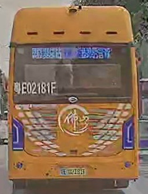

# Open Flamingo

## 1. Demo
```bash 
# zero shot inference using open flamingo
cd Flamingo
python demo.py

# or use jupyter notebook at Flamingo/demo.ipynb
```
### input image:  

### input prompt
```
"<image>the color is"
```
### output text
```
"<image>the color is yellow and the bus is yellow.<|endofchunk|>"
```
## 2. environment
```
conda env create -f environment.yml
```

```bash
# deepspeed ERROR: Failed building wheel for mpi4py
conda install -c conda-forge mpi4py openmpi
```
## 3. Dataset
- [weather classification on kaggle](https://www.kaggle.com/datasets/jehanbhathena/weather-dataset/data)
- we can use [GPT-4V](https://openai.com/research/gpt-4v-system-card) to generate pseudo label on opensource dataset of triffic scenes
see: 
- [GPT-4V free trial](https://www.gpt4v.net/zh-CN)
- [GPT-4V Example](https://mp.weixin.qq.com/s/JoWtS5LP-QJGiH3a9ZSLcQ): On the Road with GPT-4V(ision): Early Explorations of Visual-Language Model on Autonomous Driving
## 4. Mix Precision fine tuning demo on flan-t5-small
- 使用int8和fp16混合精度训练flan-t5-small
- 使用bitsandbytes库进行混合精度训练时，对int8自动反量化有额外时间开销使训练时间变长
```bash
cd tuninglab
CUDA_VISIBLE_DEVICES=0 python flan_t5.py
```
|config|GPU cost| Time cost|
|-|-|-|
| enable_int8 = True|876MiB| 10min54s/epoch|
| enable_int8 = False|2104MiB| 3min36s/epoch|

## 5. training LLM in lower cost:
- [DeepSpeed Example](https://www.philschmid.de/fine-tune-flan-t5-deepspeed)
- use [DeepSpeed Transformer block kernel](https://www.deepspeed.ai/tutorials/bert-finetuning/) for acceleration 
### 5.1 train with DeepSpeed 
```bash
cd tools
chmod +x train_flamingo.sh
./train_flamingo.sh
```
or using this command:
```bash
# DeepSpeed training 
# instead of set environment variable CUDA_VISIBLE_DEVICES,  we can use --include to specify which gpu to use
deepspeed --include=localhost:2,3,4,5 train_flamingo.py \
    # real batch size == gradient accumulation step * VISIBLE_DEVICES(world_size) * per_device_train_batch_size 
    --per_device_train_batch_size 2 \
    # learning rate
    --learning_rate 1e-5 \
    # learning rate of model weights with weight decay
    --learning_rate_pretraining_components 0 \
    # set weight decay
    --weight_decay 0 \
    --gradient_accumulation_steps 1 \
    --lr_scheduler_type cosine \
    --num_warmup_steps 100 \
    --seed 1234 \
    # please set local_rank = -1 when training in a single machine
    --local_rank -1 \
    # activation checkpointing for backpropagation accelaration
    --gradient_checkpointing \
    # stage 2 as default, stage == 3 will partition model to different devices
    --zero_stage 2 \
    # 16 bit precision, choose from fp32, fp16, bf16(obtain more stable training than fp16, see how to tain FLAN-T5 paper)
    --precision bf16 \
    # work directory
    --work_dir ../work_dir \
    # --enable_tensorboard
```
### 5.2 optimizer
- [nvdiia-apex](https://github.com/NVIDIA/apex): kernel fusion技术 避免a + b + c产生过多中间变量 see this [video](https://www.bilibili.com/video/BV1fG411G7eH/?spm_id_from=333.337.search-card.all.click&vd_source=4e49c8a2b1f29e1bff28c40551c66ebc) on bilibili
```

```
## 6. Evaluation 
### 6.1 COCO-captions
详细介绍了COCO Caption工作
- [Microsoft COCO Captions: Data Collection and Evaluation Server](https://www.arxiv-vanity.com/papers/1504.00325/)
- [BLIP-2](https://github.com/salesforce/LAVIS/blob/main/dataset_card/coco_caption.md)的README.md详细介绍了metric
- [Huggingface demo](https://github.com/huggingface/blog/blob/main/notebooks/02_how_to_generate.ipynb)介绍了generate任务
### 6.2 microsoft VQA-v2
- [evaluation page](https://visualqa.org/evaluation.html)
- [code on github](https://github.com/GT-Vision-Lab/VQA)
### 6.3 A-OK VQA
- see [code](https://github.com/allenai/aokvqa/tree/main/evaluation)
## 7. Inference
- [trion compiler](https://github.com/openai/triton)
- [trion integrated in DeepSpeed](https://github.com/microsoft/DeepSpeed/blob/master/blogs/deepspeed-triton/README.md)
- TensorRT
- Megatron-LM
- [DeepSpeed inference](https://github.com/microsoft/DeepSpeed/blob/master/docs/_tutorials/inference-tutorial.md)
## 8. LoRA Tuning

see model structure of LLaMa
```python
lora_target_modules=["q_proj", "k_proj", "v_proj", "o_proj",    #  attention layer in LLaMa
                   "to_q", "to_kv", "to_out",    # gate cross layer attention 
                    "ff.1", "ff.3"],    # 
tuning_config = dict(
    r=16,
    lora_alpha=16,
    lora_target_modules=["q_proj", "k_proj", "v_proj", "o_proj",
     "to_q", "to_kv", "to_out",
      "ff.1", "ff.3"],
    lora_dropout=0.0,
    bias="none",
    modules_to_save=[],
    task_type="VL",
    )

```
LLaMa
```
root
├── model (LlamaModel)
│   ├── embed_tokens (Embedding) weight:[32003, 4096]
│   ├── layers (ModuleList)
│   │   └── 0-31(LlamaDecoderLayer)
│   │       ├── self_attn (LlamaAttention)
│   │       │   └── q_proj,k_proj,v_proj,o_proj(Linear) weight:[4096, 4096]
│   │       ├── mlp (LlamaMLP)
│   │       │   ├── gate_proj,up_proj(Linear) weight:[11008, 4096]
│   │       │   └── down_proj (Linear) weight:[4096, 11008]
│   │       └── input_layernorm,post_attention_layernorm(LlamaRMSNorm) weight:[4096]
│   └── norm (LlamaRMSNorm) weight:[4096]
└── lm_head (Linear) weight:[32003, 4096]
```
gated_cross_attn_layer
```
        │   │       ├── gated_cross_attn_layer (GatedCrossAttentionBlock) attn_gate:[1] ff_gate:[1]
        │   │       │   ├── attn (MaskedCrossAttention)
        │   │       │   │   ├── norm (LayerNorm) weight:[4096] bias:[4096]
        │   │       │   │   ├── to_q (Linear) weight:[512, 4096]
        │   │       │   │   │   ├── lora_dropout (ModuleDict)
        │   │       │   │   │   ├── lora_A (ModuleDict)
        │   │       │   │   │   │   └── default (Linear) weight:[16, 4096]
        │   │       │   │   │   └── lora_B (ModuleDict)
        │   │       │   │   │       └── default (Linear) weight:[512, 16]
        │   │       │   │   ├── to_kv (Linear) weight:[1024, 1024]
        │   │       │   │   │   ├── lora_dropout (ModuleDict)
        │   │       │   │   │   ├── lora_A (ModuleDict)
        │   │       │   │   │   │   └── default (Linear) weight:[16, 1024]
        │   │       │   │   │   └── lora_B (ModuleDict)
        │   │       │   │   │       └── default (Linear) weight:[1024, 16]
        │   │       │   │   └── to_out (Linear) weight:[4096, 512]
        │   │       │   │       ├── lora_dropout (ModuleDict)
        │   │       │   │       ├── lora_A (ModuleDict)
        │   │       │   │       │   └── default (Linear) weight:[16, 512]
        │   │       │   │       └── lora_B (ModuleDict)
        │   │       │   │           └── default (Linear) weight:[4096, 16]
        │   │       │   └── ff (Sequential)
        │   │       │       ├── 0 (LayerNorm) weight:[4096] bias:[4096]
        │   │       │       ├── 1 (Linear) weight:[16384, 4096]
        │   │       │       │   ├── lora_dropout (ModuleDict)
        │   │       │       │   ├── lora_A (ModuleDict)
        │   │       │       │   │   └── default (Linear) weight:[16, 4096]
        │   │       │       │   └── lora_B (ModuleDict)
        │   │       │       │       └── default (Linear) weight:[16384, 16]
        │   │       │       └── 3 (Linear) weight:[4096, 16384]
        │   │       │           ├── lora_dropout (ModuleDict)
        │   │       │           ├── lora_A (ModuleDict)
        │   │       │           │   └── default (Linear) weight:[16, 16384]
        │   │       │           └── lora_B (ModuleDict)
        │   │       │               └── default (Linear) weight:[4096, 16]
```